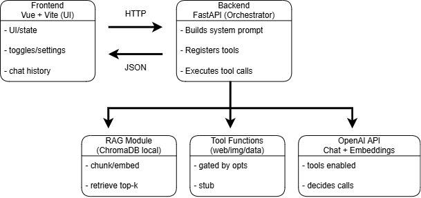

# AI Tool-Calling Chat App (Vue + FastAPI + OpenAI + ChromaDB)

This repository is a small full‑stack AI chat demo. The goal is to demonstrate **backend‑enforced capability toggles**, **single‑round tool calling**, and a simple **file upload + RAG** pipeline with a clean, minimal architecture.

## Current state (what is implemented today)

- **Backend‑enforced capability toggles**: disabled tools are **not registered at all**, so the model cannot call them.
- **Single‑round tool calling**: `POST /chat` runs at most **one tool round** (LLM → tools → LLM).
- **RAG (ChromaDB + OpenAI embeddings)**:
   - `POST /files/upload` stores files on disk and supports `.txt`, `.md`, `.pdf`, `.docx` formats.
   - If `OPENAI_API_KEY` is present, the backend chunks (respecting sentence/Markdown boundaries) → embeds → persists to ChromaDB.
   - In `/chat`, retrieval runs automatically if session has uploaded files, injecting readable context as a system message prefixed with `RAG_CONTEXT:`.

- **Tools (Implemented — stub)**:
   - `web_search`, `generate_image`, `analyze_json` exist as tools and can be called by the model, but __they do not have real integrations yet__. They return empty / summary outputs with a “not implemented” note.

```console
These tools are intentionally stubbed to demonstrate tool-calling, gating, and orchestration logic, not external integrations.
```

---

## Architecture overview

### High-level design goals

- **Clear separation of concerns**
   - Frontend = UI + local state only (messages, session id, toggles)
   - Backend = orchestration + safety + prompt construction + tool exposure
   - RAG = its own module/service (not embedded in `/chat` handler logic)

### High-level diagram




### Frontend responsibilities

- Owns chat UI + local state (message history, session id, settings toggles).
- For every `POST /chat` request, it sends:
   - `session_id`
   - full `messages` history
   - `settings` (capability toggles)

- File upload UI currently lives in the **Chat page** (`/chat`).
- Note: the backend can return `tool_calls`, but the current UI __does not render tool logs__ (it keeps them in state only).
- The dedicated `/files` page is currently a **placeholder** (stub UI).

### Backend responsibilities

- Builds a system prompt including enabled/disabled tool list.
- Registers **only enabled tools** in the OpenAI `tools` list.
- Calls OpenAI Chat Completions.
- If tool calls are returned:
   - executes tools safely
   - injects tool results into the conversation
   - calls OpenAI **one more time**

- Optionally performs RAG retrieval and injects `RAG_CONTEXT:` as a separate system message.

---

## API

### GET `/health`

- **Purpose**: health check
- **Response**:

```json
{ "status": "ok" }

```

### POST `/chat`

- **Purpose**: chat/agent orchestration (LLM + optional tools + optional RAG)
- **Request (JSON)**:

```json
{
  "session_id": null,
  "messages": [{ "role": "user", "content": "Hello" }],
  "settings": {
    "web_search": false,
    "image_generation": false,
    "data_analysis": false,
    "think_mode": false
  }
}

```

- **Response (JSON)**:

```json
{
  "session_id": "…",
  "assistant_message": { "role": "assistant", "content": "…" },
  "tool_calls": [
    {
      "name": "web_search",
      "input": { "query": "…" },
      "output_preview": "…",
      "error": null
    }
  ],
  "error": null
}

```

**Important behavior (current code)**

- If `OPENAI_API_KEY` is missing: the endpoint still returns __HTTP 200__, but `error` is set and `assistant_message` is `null`.
- Tool calling is capped to **one tool round**.

### POST `/files/upload` (multipart)

- **Purpose**: file upload + (if possible) ingest into RAG store
- **Form fields**:
   - `files`: 1..N files
   - `session_id`: optional (if missing, the backend generates one)

- **Response example**:

```json
{
  "session_id": "…",
  "stored": [{ "filename": "note.txt", "bytes": 11, "content_type": "text/plain" }],
  "ingest": { "session_id": "…", "documents_loaded": 1, "chunks_created": 1, "stored": 1 },
  "ingest_error": null
}

```

**Important behavior (current code)**

- Files are stored under `STORAGE_DIR/<session_id>/`.
- If `OPENAI_API_KEY` is missing, upload still succeeds; only `ingest_error` is set (because embeddings cannot be generated).

### GET `/files?session_id=...`

- **Purpose**: list files stored on disk for a given session
- **Response**:

```json
{
  "session_id": "…",
  "files": [{ "filename": "note.txt", "bytes": 11 }]
}

```

---

## Capability toggles (4 features)

Frontend stores toggles in `localStorage` and sends them with each `POST /chat` request. **Enforcement is in the backend** (disabled tools are not registered).

### Web Search — Implemented (stub)

- __Tool name__: `web_search`
- **Current behavior**: returns empty `results` + a “not implemented yet” note.
- **Expected later**: SerpAPI / Tavily / Bing (or similar) integration returning sources/snippets.

### Image Generation — Implemented (stub)

- __Tool name__: `generate_image`
- **Current behavior**: returns empty `images` + a “not implemented yet” note.
- **Expected later**: OpenAI Images (or another provider) integration.

### Data Analysis — Implemented (stub)

- __Tool name__: `analyze_json`
- **Current behavior**: returns `type` + a small serialized `preview` of the provided JSON-like payload.
- **Expected later**: real analysis (statistics, summaries, transformations, etc.).

### Think Mode — Prompt flag (active)

- Not a tool; it only adds a “Think mode enabled” line to the system prompt.
- Intended effect: encourage more thorough answers (model behavior).

---

## RAG (Retrieval‑Augmented Generation)

### Pipeline (current)

1. `POST /files/upload` stores files on disk.
2. Backend:
   - loads file content as “text” when possible,
   - chunks the content,
   - (if API key exists) generates embeddings,
   - persists chunks/embeddings to ChromaDB.

3. In `POST /chat`, retrieval runs automatically if the session has uploaded files:
   - query embedding is generated
   - If user mentions a specific filename in their message, only chunks from that file are retrieved
   - Otherwise, Chroma query with `where={"session_id": session_id}` retrieves top-k chunks from all session files
   - retrieved chunks are injected as a readable system message with `RAG_CONTEXT:` prefix
   - fallback: if no files in session, keyword-based heuristic triggers retrieval (e.g., “file”, “document”, “pdf”, “upload”, “attached”, etc.)

### Supported file types (current)

- **Text files**: `.txt` (UTF-8)
- **Markdown**: `.md`, `.markdown`
- **PDF**: `.pdf` (text extraction via `pypdf`)
- **DOCX**: `.docx` (text extraction via `python-docx`)
- Other formats: fallback to text reading if possible, otherwise returns an error message

### Retrieval trigger (current)

- __Primary__: Automatic if session has uploaded files (checks `STORAGE_DIR/<session_id>/` for files)
- **Filename filtering**: If user mentions a specific filename in their message, only that file's chunks are retrieved (case-insensitive matching)
- **Fallback**: Keyword-based heuristic on user message (e.g., “file”, “document”, “pdf”, “upload”, “attached”, etc.)

### File-specific retrieval

When a user mentions a specific file (by name or extension), the system automatically filters retrieval to only include chunks from that file. This prevents mixing content from multiple files when asking about a specific document. Examples:

- "bu dosyadaki veriler" → matches filename in message
- "legal_document_rows.csv" → retrieves only from that CSV file
- Generic queries without filename → retrieves from all session files

### Chunking strategy (current)

- Respects sentence boundaries (`.`, `!`, `?` followed by whitespace)
- Preserves Markdown structure (headers, code blocks, paragraphs)
- Overlap handled at natural boundaries (sentence/paragraph breaks)
- Falls back to simple chunking for very small chunks or when boundaries not found

---

## Configuration

### Backend `.env`

Copy `backend/env.example` to `backend/.env` and fill at least:

- `OPENAI_API_KEY`

Other useful variables:

- `OPENAI_MODEL` (default: `gpt-4.1-mini`)
- `OPENAI_EMBEDDING_MODEL` (default: `text-embedding-3-small`)
- `CORS_ORIGINS` (default: `http://localhost:5173`)
- `STORAGE_DIR` (default: `./storage`)
- `CHROMA_PERSIST_DIR` (default: `./chroma`)
- `CHROMA_COLLECTION` (default: `rag_chunks`)

### Frontend env

- `VITE_API_BASE_URL` (default: `http://127.0.0.1:8000`)

---

## Prerequisites

- **Python**: 3.10+ (recommended 3.11+)
- **Node.js**: 18+ (recommended 20+)
- **pnpm**: use the version pinned by `frontend/package.json` (`packageManager`)

---

## Run locally (Windows PowerShell)

### Backend (FastAPI)

```powershell
cd backend
python -m venv .venv
. .\.venv\Scripts\Activate.ps1
pip install -r requirements.txt
uvicorn app.main:app --reload --host 127.0.0.1 --port 8000

```

### Frontend (Vue + Vite)

This repo includes a `pnpm-lock.yaml`:

```powershell
cd frontend
pnpm install
pnpm dev

```

Frontend default: `http://localhost:5173` (Vite).

---

## Quick checklist

- `GET /health` → `{"status":"ok"}`
- Chat:
   - without `OPENAI_API_KEY`: `POST /chat` → HTTP 200 + `error` set
   - with key: `POST /chat` returns an assistant response (and may call enabled tools)

- Upload:
   - `POST /files/upload` stores files on disk
   - without key: `ingest_error` is set
   - with key: embeddings are generated and data is persisted to ChromaDB

---

## Tests

- Smoke test: `backend/app/tests/test_e2e_smoke.py`
   - validates route wiring without calling OpenAI
   - asserts deterministic “missing key” behavior

---

## Limitations (known)

- Web search / image generation / data analysis tools are **stub** implementations.
- Frontend does not show `tool_calls` logs in the UI.
- RAG: no citations/reranking UI; chunking respects boundaries but could be further optimized.
- No auth / multi‑tenant hardening; not production‑hardened.
- OCR support for images is not implemented (PDF/DOCX text extraction only).

---

## Next steps (suggested)

- Implement real tool integrations (web search / image generation / data analysis)
- Improve RAG: citations/reranking UI, CSV parsing, image OCR support
- Add a tool‑call timeline UI
- Streaming responses (SSE/WebSocket)
- Auth + rate limiting + observability